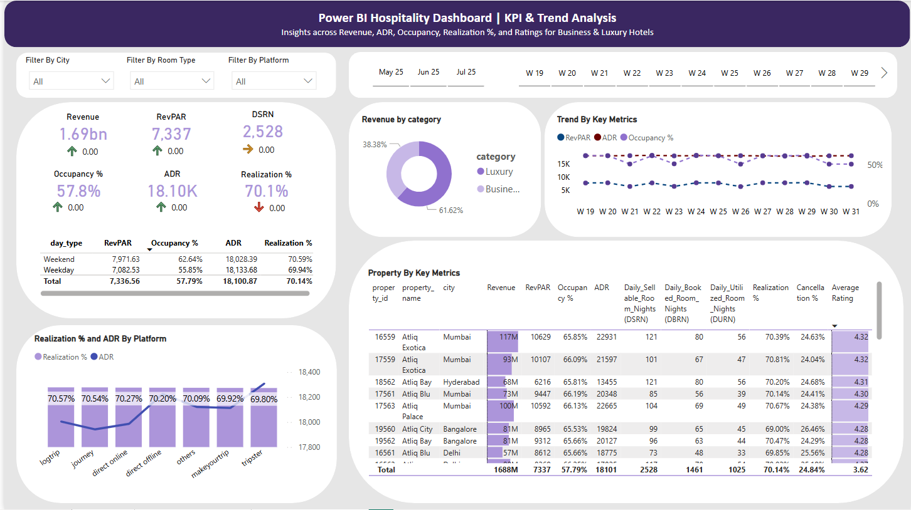

# 🏨 Power BI Hospitality Dashboard | KPI & Trend Analysis
End-to-end Power BI dashboard with KPIs, trend insights, and DAX-based analytics for hospitality bookings

This interactive **Power BI dashboard** delivers end-to-end insights into key performance metrics in the **hospitality industry**. It empowers data-driven decision-making through dynamic visualizations of bookings, revenue, occupancy trends, and guest satisfaction.

---

## 🎯 Objective

To develop a data-driven dashboard that enables hospitality stakeholders to monitor operational performance, understand customer behavior, and uncover optimization opportunities across various hotel categories, platforms, and time periods.

---

## 🌟 Project Highlights

- 📈 Real-time KPIs: ADR, RevPAR, Occupancy %, Realization %, Ratings
- 🗂️ Week-over-Week trends with DAX-based comparisons
- 📅 Weekday vs. Weekend booking performance
- 🧭 City, room class, and platform-level analysis
- 🎯 Clear UI with slicers, tooltips, and interactivity

---

## 🛠️ Tech Stack Used

- **Power BI Desktop**: Data modeling, DAX calculations, and visualization
- **DAX**: For KPIs, WoW change %, Realization %, and conditional logic
- **CSV Files**: Source datasets including bookings, room types, hotel info, and calendar
- **Power Query**: Data transformation and relationship building

---

## 🧩 Data Model Overview

**Tables Used**  
📁 `fact_bookings`, `fact_aggregated_bookings`  
📁 `dim_date`, `dim_hotels`, `dim_rooms`

**Custom Measures Created**  
🧮 Revenue, ADR, RevPAR, Occupancy %, Realization %, WoW % Changes, Avg Rating, Cancellation %

---

## 📁 Project Structure

```bash
📦 PowerBI-Hospitality-Dashboard
├── 📊 HospitalityDashboard.pbix
├── 📁 Datasets/
│   ├── fact_bookings.csv
│   ├── fact_aggregated_bookings.csv
│   ├── dim_date.csv
│   ├── dim_hotels.csv
│   └── dim_rooms.csv
├── 📁 Screenshots/
│   ├── kpi_cards.jpg
│   ├── revenue_trend.jpg
│   ├── bookings_by_platform.jpg
├── 📄 README.md
```

---

## 📷 Screenshots

### 🧩 Dashboard

> 

### 📈 Revenue Trend By Category

> 

### 🛍️ Tooltip

> 

### 📈 Revenue Trend By Day Type

> 

---

## 🔍 Key Insights & Takeaways

- Luxury hotels perform better during weekends; business hotels hold steady during weekdays.
- Direct online bookings tend to have higher realization and revenue.
- Revenue dropped notably during W23, suggesting potential external impact or campaign expiration.
- High cancellation rates detected on third-party platforms, indicating room for improvement in reliability or policy clarity.

---

## 🚀 Optimization Results

- Defined DAX-based Realization % and ADR to isolate platform inefficiencies.
- Identified underperforming segments by room class and city.
- Enhanced user experience with filters and dynamic visuals.
- Created WoW performance cards for continuous KPI monitoring.

---

## 📌 Business Recommendations

- Run exclusive weekend campaigns for luxury hotels to boost off-peak occupancy.
- Incentivize guests for completing direct bookings via own platform.
- Investigate W23 drop — was it seasonal, external, or operations-related?
- Improve clarity and communication on cancellation policies to reduce BRN-to-URN gaps.

---

## 🧠 Learnings & Takeaways

- 💡 Built a high-impact, user-friendly dashboard using Power BI
- 📊 Designed dynamic KPIs and visuals using DAX and modeling best practices
- 🔍 Improved data storytelling through time-based comparisons and platform insights
- ✅ Created a dashboard ready for stakeholder presentation and portfolio use

---

## 📬 Let’s Connect!

📧 mmeshram@umassd.edu  
🔗https://www.linkedin.com/in/mayur-meshram9/ 

---

*Built with 💜 using Power BI*
